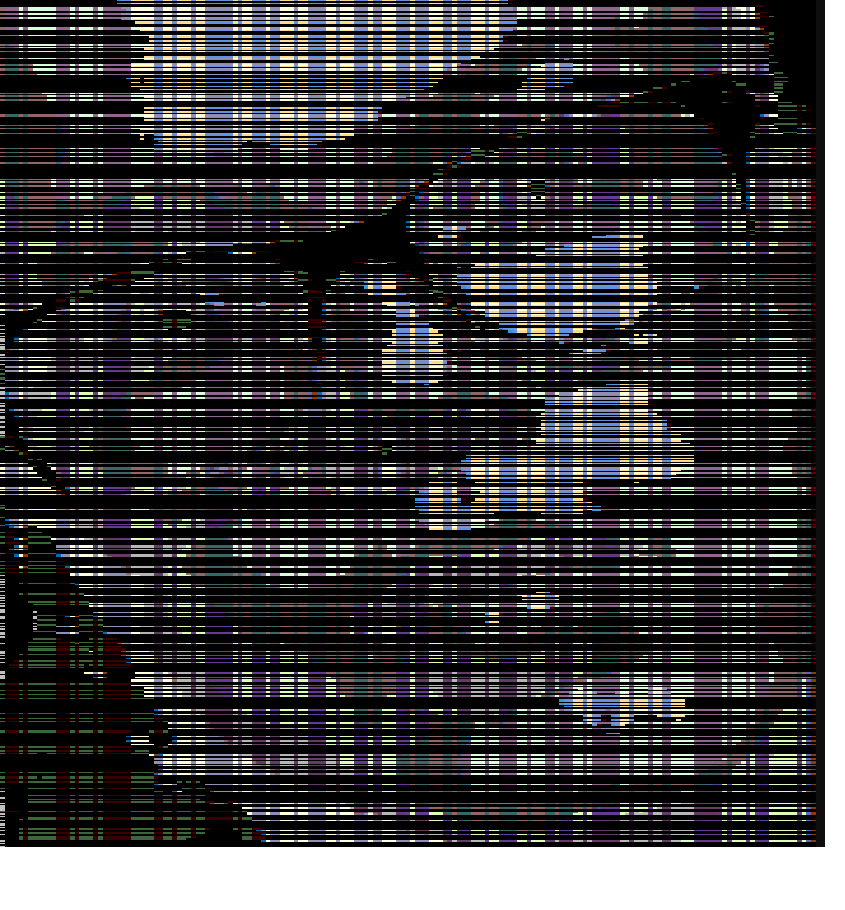

# Intro in GIT

## Mans logo

# Komandas
'''

git clone repozitorija-URL                      # Nokopē no github repozitoriju

git status                                      # Repozitorija status

git add .                                       # Repozitorija sagatavošana commit

git commit -m "Repozitorija commit nosaukums"   # Versijas izvade githuba

git push origin main                            # Augšupielādēt repozitoriju

'''

## Status
Izstrādes režīmā.

## Projekti
1.) SodiumNitrate's blog
2.) Foozie discord bot
3.) Muzon (Reklāmas mājaslapa)
4.) SA-MP servers
5.) FiveM servers
6.) Miten (Spēļu tornamentu vadīšanas mājaslapa)
4.) Citi mazi projekti

## Tabula
| Syntax | Description |
| ----------- | ----------- |
| Header | Title |
| Paragraph | Text |

## Autors
Renārs Gausiņš | NātrijaNitrāts | SodiumNitrate